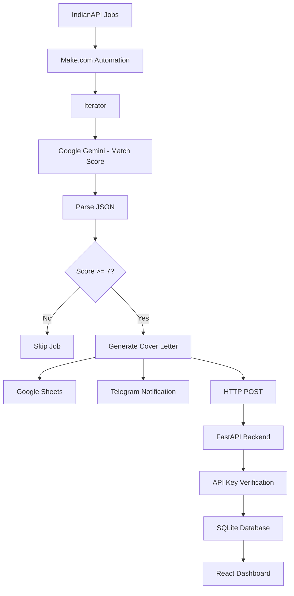

# 🚀 Job Application Autopilot

### AI-Powered Job Discovery, Matching & Application Management

An AI-powered full-stack application that automates job discovery, evaluates opportunities based on a candidate's profile, generates personalized cover letters, and organizes relevant jobs in a centralized dashboard.

Built using **Make.com, Google Gemini, FastAPI, React, SQLite, and Telegram**, this project combines AI and workflow automation to reduce repetitive tasks in the job search process.

---

## ✨ Features

- 🔎 **Automated Job Discovery:** Fetch job listings through the IndianAPI jobs API.
- 🧠 **AI-Powered Job Matching:** Uses Google Gemini to compare job requirements with a candidate's skills, projects, and career goals.
- 🎯 **Smart Match Scoring:** Assigns a score from 0 to 10 with a short explanation of the match.
- ✍️ **Personalized Cover Letters:** Generates job-specific cover letters using candidate and job information.
- ⚡ **Workflow Automation:** Connects job discovery, AI evaluation, filtering, data storage, and notifications through Make.com.
- 📊 **Interactive Dashboard:** A React-based interface for viewing and managing job opportunities.
- 📬 **Telegram Notifications:** Delivers relevant job details, match scores, application links, and cover letters.
- 🗂️ **Application Tracking:** Organizes job listings, cover letters, and application status.
- 🔐 **Secure API:** Protects job creation with API key authentication.
- 🔄 **REST API Integration:** Connects Make.com to the FastAPI backend and SQLite database.

> The system assists with job discovery and application preparation. It does not automatically submit job applications.

---

## 🏗️ System Architecture



### How It Works

1. **Job Collection:** Make.com retrieves job listings from IndianAPI.
2. **Data Processing:** The Iterator processes each job individually.
3. **AI Evaluation:** Gemini evaluates the job against the candidate's profile and returns a structured score and match reason.
4. **Filtering:** Jobs scoring 7 or higher pass through the configured filter.
5. **Cover Letter Generation:** Gemini generates a personalized cover letter for each qualifying job.
6. **Data Storage:** Job information and generated content are sent to Google Sheets and the FastAPI backend.
7. **Notifications:** Telegram sends job details, match scores, application links, and cover letters.
8. **Dashboard:** The React frontend displays and organizes job information retrieved through the backend API.

---

## 🛠️ Tech Stack

| Category | Technologies |
|---|---|
| Frontend | React, Vite, JavaScript, CSS |
| Backend | Python, FastAPI |
| Database | SQLite, SQLAlchemy |
| AI / LLM | Google Gemini 2.5 Flash |
| Automation | Make.com |
| Job Data | IndianAPI |
| Notifications | Telegram Bot API |
| Data Management | Google Sheets |
| API Communication | REST API, HTTP, JSON |
| Authentication | API Key |
| Deployment | Render |
| Version Control | Git, GitHub |

---

## 📁 Project Structure

```text
Job-Application-Autopilot/
│
├── backend/
│   ├── main.py
│   ├── models.py
│   ├── schemas.py
│   ├── database.py
│   ├── mock_data.py
│   └── requirements.txt
│
├── frontend/
│   ├── src/
│   ├── public/
│   ├── package.json
│   └── ...
│
├── docs/
│
├── .gitignore
└── README.md
```

---

## ⚙️ Getting Started

### 1. Clone the Repository

```bash
git clone https://github.com/STARBORN-10/Job-Application-Autopilot.git
cd Job-Application-Autopilot
```

### 2. Set Up the Backend

```bash
cd backend
python -m venv .venv
```

Activate the virtual environment.

**Windows:**

```powershell
.venv\Scripts\activate
```

**macOS / Linux:**

```bash
source .venv/bin/activate
```

Install dependencies:

```bash
pip install -r requirements.txt
```

### 3. Configure Environment Variables

Set the API key used to protect the job creation endpoint.

Create a `.env` file if your local setup uses an environment variable loader, or configure the variable directly in your environment.

```env
MAKE_API_KEY=your_secure_api_key
```

Use the same secret in the Make.com HTTP module's `x-api-key` header.

**Never upload real API keys, tokens, or credentials to GitHub.**

### 4. Run the Backend

From the `backend` directory:

```bash
uvicorn main:app --reload
```

Backend URL:

```text
http://127.0.0.1:8000
```

Interactive API documentation:

```text
http://127.0.0.1:8000/docs
```

### 5. Run the Frontend

Open a separate terminal:

```bash
cd frontend
npm install
npm run dev
```

Open the local development URL provided by Vite, usually:

```text
http://localhost:5173
```

Make sure the frontend is configured to use the intended backend API URL.

---

## 🔌 API Endpoints

The FastAPI backend provides REST endpoints for job management.

| Method | Endpoint | Description |
|---|---|---|
| GET | `/api/jobs` | Retrieve job listings |
| POST | `/api/jobs` | Create a job record (API key required) |
| GET | `/api/jobs/{id}` | Retrieve a specific job |
| PUT | `/api/jobs/{id}` | Update a job record |
| DELETE | `/api/jobs/{id}` | Delete a job record |

### Example: Create a Job

**Request:**

```http
POST /api/jobs
Content-Type: application/json
x-api-key: YOUR_API_KEY
```

**Request Body:**

```json
{
  "title": "Data Analyst Intern",
  "company": "Example Company",
  "url": "https://example.com/job",
  "location": "India",
  "description": "Analyze business data and generate insights.",
  "job_type": "Internship",
  "experience": "Fresher",
  "source": "IndianAPI",
  "score": 8.5,
  "match_reason": "Strong alignment with Python and SQL skills.",
  "cover_letter": "Personalized cover letter content.",
  "status": "To Apply"
}
```

---

## 🧠 AI Job Matching

The matching system evaluates job listings using a candidate profile that includes:

- Programming languages and technical skills
- AI, machine learning, and data science knowledge
- Relevant projects and practical experience
- Target job roles
- Experience and eligibility requirements

Each job receives a score from **0 to 10**.

| Score | Interpretation |
|---|---|
| 9–10 | Excellent match |
| 7–8 | Good match |
| 5–6 | Partial match |
| 0–4 | Poor match |

Only jobs with a score of **7 or above** pass through the current automation filter.

The score is an AI-generated estimate, not a guarantee of eligibility or hiring success.

---

## 🔐 Security and Data Handling

- Job creation is protected through API key verification.
- The backend reads the expected key from an environment variable.
- API credentials should be stored securely in the relevant service configurations.
- SQLite is used to store job records.
- Applications are not submitted automatically.

**Deployment note:** The current backend is hosted on Render's free service and uses SQLite. Free hosting can experience cold starts, and ephemeral storage should not be treated as permanent production storage.

---

## ☁️ Deployment

The backend is deployed on Render.

- **Backend:** https://job-application-autopilot.onrender.com
- **API Documentation:** https://job-application-autopilot.onrender.com/docs
- **GitHub Repository:** https://github.com/STARBORN-10/Job-Application-Autopilot

The React frontend can be run locally using Vite. To publish it, deploy it separately and configure its API URL and the backend's CORS settings.

---

## 🚧 Future Enhancements

- [ ] Persistent cloud database integration
- [ ] Job deduplication to prevent repeated listings
- [ ] Advanced filtering by role, location, salary, and experience
- [ ] Resume upload and profile customization
- [ ] Resume-to-job compatibility analysis
- [ ] Application progress analytics and visualizations
- [ ] Improved error handling and retry mechanisms
- [ ] Integration with additional job sources
- [ ] Production deployment of the React dashboard
- [ ] User authentication and multi-profile support

---

## 🎯 Project Objective

The goal of Job Application Autopilot is to explore how **AI, workflow automation, and full-stack development** can work together to solve a practical problem.

By automating repetitive job-search tasks, the system helps candidates identify relevant opportunities, prepare application materials, and organize their job search in one place—while keeping the final application decision in their hands.

---

## 👨‍💻 Developer

**Soham H. Wadekar**  
B.Tech Computer Science Engineering — AI & ML  
University of Engineering and Management, Jaipur

- GitHub: [STARBORN-10](https://github.com/STARBORN-10)
- Project: [Job Application Autopilot](https://github.com/STARBORN-10/Job-Application-Autopilot)

---

⭐ If you find this project interesting, consider giving the repository a star!